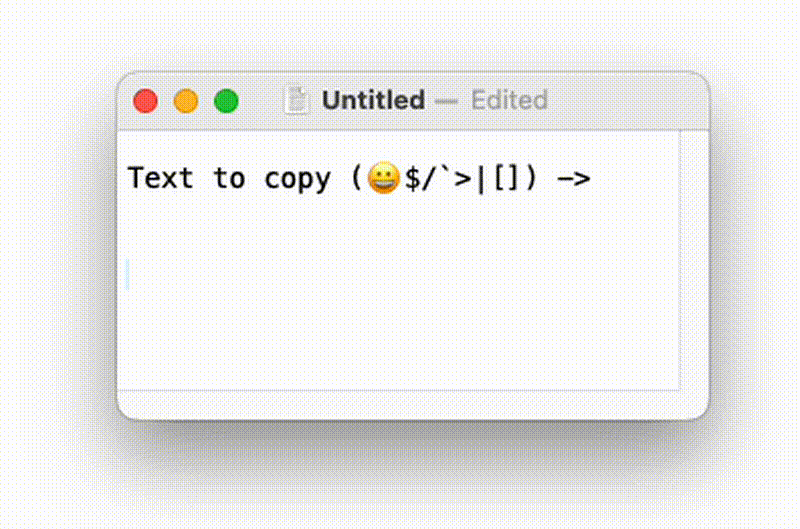

# Local OCR to Clipboard (macOS)

Automatically OCR screenshots and copy text to clipboard on macOS. No cloud services, runs 100% locally.

Fast and accurate OCR using macOS native Vision framework via Swift!

## Quick Setup

```bash
git clone https://github.com/ewernn/localOCRtoClipboard.git
cd localOCRtoClipboard
./setup.sh
```

That's it! 🎉

Just use the native **Cmd+Shift+4** hotkey - text is automatically OCR'd and copied to clipboard!

## Example



## Usage

1. Press **Cmd+Shift+4** (native macOS screenshot hotkey)
2. Select area containing text
3. Text is **instantly** OCR'd and copied to clipboard!
4. Screenshot is automatically deleted after processing

*Note: Setup disables the 5-second screenshot preview for instant OCR.*

## How it works

- Uses native **Cmd+Shift+4** screenshot hotkey - no custom keybindings needed!
- Lightweight Swift binary watches `/tmp/ocr-screenshots/` using FSEvents
- macOS Vision framework extracts text directly - faster and more accurate than Tesseract
- Text automatically copied to clipboard via NSPasteboard
- Screenshots auto-deleted immediately after OCR processing
- Everything stored in `/tmp/ocr-screenshots/` (auto-cleaned on reboot)
- Runs as LaunchAgent - no Python, no dependencies, just native Swift!

## Uninstall

```bash
./setup.sh --uninstall
```

## Manual Setup

If you prefer to set up manually:

1. Compile the Swift binary:
   ```bash
   ./compile.sh
   ```

2. Set screenshot location:
   ```bash
   defaults write com.apple.screencapture location /tmp/ocr-screenshots
   killall SystemUIServer
   ```

3. Install LaunchAgent:
   ```bash
   # Update the plist with your binary path
   sed "s|BINARY_PATH_PLACEHOLDER|$(pwd)/ocr-watcher|g" com.local.ocr-watcher.plist > ~/Library/LaunchAgents/com.local.ocr-watcher.plist

   # Load the agent
   launchctl load ~/Library/LaunchAgents/com.local.ocr-watcher.plist
   ```

## Troubleshooting

Check logs if OCR isn't working:
```bash
tail -f /tmp/ocr-watcher.log
tail -f /tmp/ocr-watcher-error.log
```

## Requirements

- macOS 10.15+ (for Vision framework)
- Xcode Command Line Tools (`xcode-select --install`)
